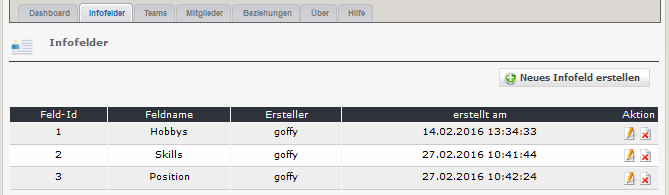
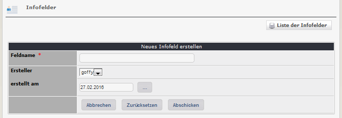

# 2.1 Infofelder

Für jede Person gibt es Standardinfofelder wie z.B. Name, E-Mail usw (siehe auch [Mitglieder](2admin_members.md)).
Für die Verwendung mit Teams siehe auch [Beziehungen](2admin_relations.md).

#### 2.1.1 Liste der Infofelder
Auf den Registerblatt 'Infofelder' sehen Sie eine Auflistung aller bereits existierenden Infofelder.

#### 2.1.2 Infofelder hinzufügen/bearbeiten

Es ist nur der Infofeldname erforderlich. Dieser kann auf der Userseite auch angezeigt werden.
