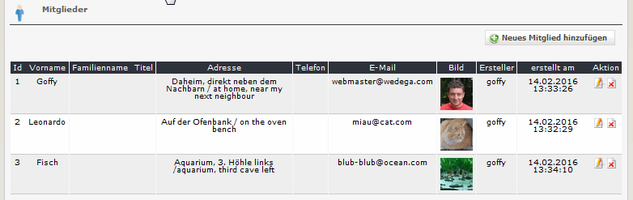
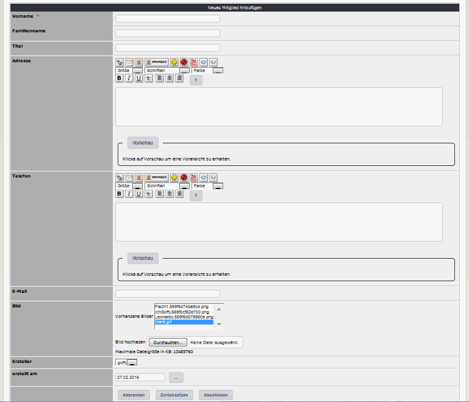

# 2.3 Mitglieder

Sie können beliebig viele Personen definieren, die dann später mit einem oder mehreren Teams kombiniert werden können.

#### 2.3.1 Liste der Mitglieder
Auf den Registerblatt 'Mitglieder' sehen Sie eine Auflistung aller bereits existierenden Mitglieder.

#### 2.3.2 Mitglieder hinzufügen/bearbeiten

Neben dem Namen können Sie für jede Person folgende Standardinformationen erfassen:
* Titel
* Adresse
* Telefon
* E-Mail

Diese Informationen werden für jedes Team verwendet.
Zusätzlich können Sie für jede Person auch noch ein Bild hochladen.
