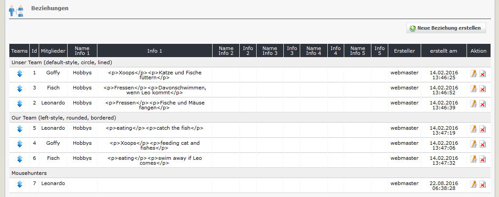

# 2.4 Beziehungen

Wenn Sie Teams erstellt und Mitglieder sowie eventuell Infofelder erfasst haben, können Sie diese in Beziehung zueinander setzen.

#### 2.4.1 Liste der Beziehungen
Auf den Registerblatt 'Beziehungen' sehen Sie eine Auflistung aller bereits festgelegten Beziehungen.

#### 2.4.2 Beziehungen hinzufügen/bearbeiten

#### Teams und Mitlglieder
Legen Sie die Teams und Personen fest, die verknüpft werden sollen.

#### Infofelder
Zusätzlich können Sie fünf Infofelder verwenden, welche dann auf der Userseite für diese Beziehung angezeigt werden.

#### Reihung
Legen Sie die Reihung der Mitglieder auf der Userseite fest.
