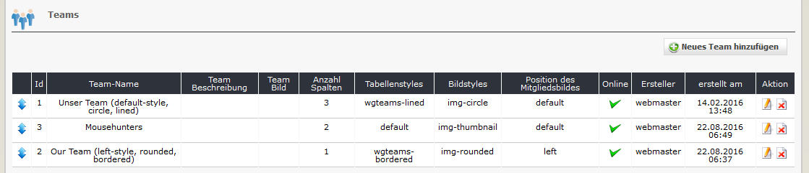
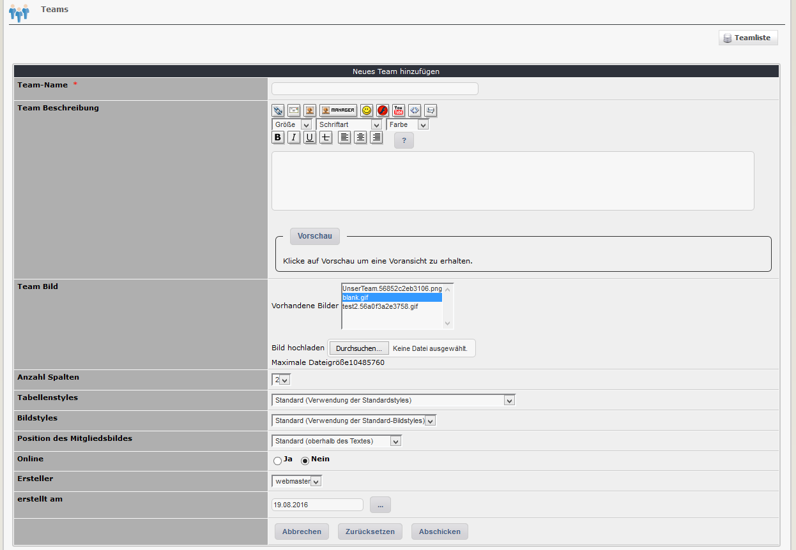

# 2.2 Teams

Sie können beliebig viele Teams erstellen, welche Sie dann mit einem oder mehreren Mitgliedern verknüpfen können.

#### 2.2.1 Liste der Teams
Auf den Registerblatt 'Teams' sehen Sie eine Auflistung aller bereits erfassten Teams mit den jeweiligen Einstellungen.

Sofern auf der Userseite eine Liste mit mehreren Teams verwendet wird, kann die Reihung mit Drag&Drop geändert werden.

#### 2.2.2 Teams hinzufügen/bearbeiten

#### Teamname
Bitte definieren Sie einen Teamnamen. Dieser Name wird auf der Userseite angezeigt.

#### Team Beschreibung
Sie können zusätzliche Informationen betreffend eines Teams erfassen, die auf der Userseite angezeigt werden.

#### Team Bild
Sie können pro Team ein Teambild verwenden. Dieses Bild wird auf der Userseite angezeigt.

#### Anzahl Spalten
Bitte definieren Sie, wieviele Personen auf der Userseite in einer Reihe angezeigt werden.

#### Tabellenstyles
Definieren Sie den Tabellenstyle, der auf der Userseite verwendet werden soll.
Folgende Optione sind verfügbar:
* Standard (Verwendung der Standardstyles)
* Bordered (fügt der Tabelle und den Zellen einen Rahmen hinzu)
* Striped (fügt allen Zeilen einen abwechselnd gestreiften Hintergrund hinzu)
* Lined (fügt den Zeilen einen oberen Rahmen hinzu)

#### Bilderstyles
Definieren Sie den Bilderstyle, der auf der Userseite verwendet werden soll.
Folgende Optione sind verfügbar:
* Standard (Verwendung der Standard-Bildstyles)
* Circle (zeigt das Bild in Kreisform)
* Rounded (zeigt das Bild mit abgerundeten Ecken)
* Thumbnail (zeigt das Bild als Vorschaubild)

#### Position des Mitgliederbildes
Definieren Sie die Position des Mitgliederbildes, an der es auf der Userseite angezeigt werden soll.
Folgende Optione sind verfügbar:
* Links (auf der linken Seite des Textes)
* Standard (oberhalb des Textes)
* Rechts (auf der rechten Seite)

#### Online
Legen Sie fest, ob ein Team auf der Userseite angezeigt werden soll.
Sie können ein Team erstellen und alle erforderlichen Personen als Mitglieder festlegen. Wenn Sie mit allem fertig sind, können Sie Online auf 'Ja' setzen.
