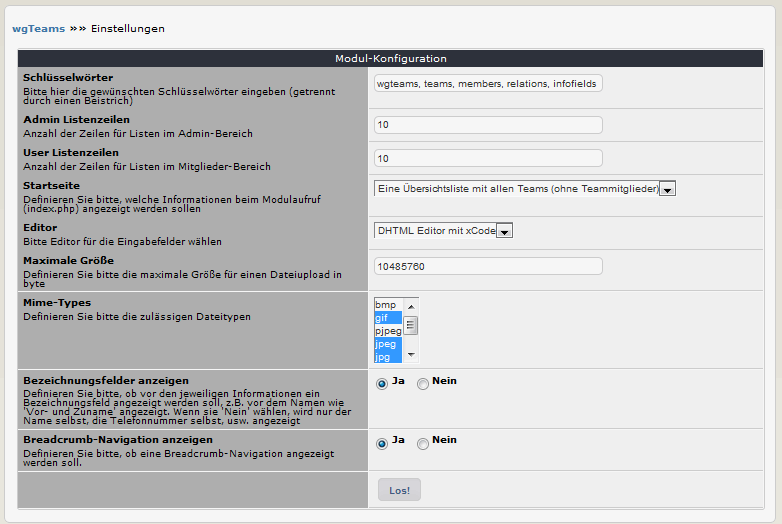

# 3. Einstellungen

In den Moduleinstellungen können Sie verschiedene Optionen festlegen: 

## 3.1 Optionen im Detail
#### Schlüsselwörter
Bitte hier die gewünschten Schlüsselwörter eingeben (getrennt durch einen Beistrich), welche dann in den Metatags verwendet werden.

#### Admin Listenzeilen
Definieren Sie die Anzahl der Einträge in Listen im Adminbereich.

#### User Listenzeilen
Definieren Sie die Anzahl der Einträge in Listen im Userbereich.

#### Startseite
Definieren Sie bitte, welche Informationen beim Modulaufruf (index.php) angezeigt werden sollen.
Es gibt folgende Optionen:
* Eine Übersichtsliste mit allen Teams (ohne Teammitglieder)
* Alle Teams mit allen Mitgliedern
* Das erste Team

#### Editor
Bitte wählen Sie den Editor für die Eingabefelder im Adminbereich.

#### Maximale Größe
Definieren Sie bitte die maximale Größe für einen Dateiupload. Sie müssen den Wert für Bytes angegeben (10485760 = 1 MB).

#### Mime-Types
Definieren Sie bitte die zulässigen Dateitypen für einen Dateiupload.

#### Bezeichnungsfelder anzeigen
Definieren Sie bitte, ob vor den jeweiligen Informationen ein Bezeichnungsfeld angezeigt werden soll, z.B. vor dem Namen wie 'Vor- und Zuname' angezeigt. Wenn sie 'Nein' wählen, wird nur der Name selbst, die Telefonnummer selbst, usw. angezeigt.

#### Breadcrumbs-Navigation anzeigen
Definieren Sie bitte, ob eine Breadcrumb-Navigation angezeigt werden soll.
