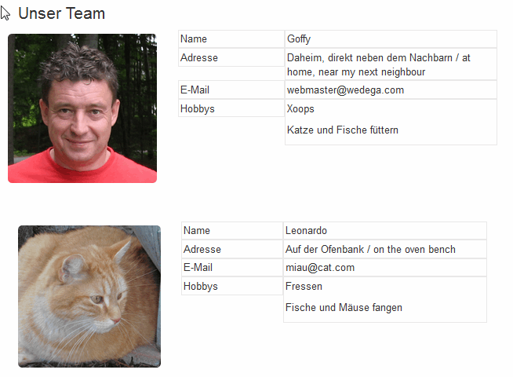
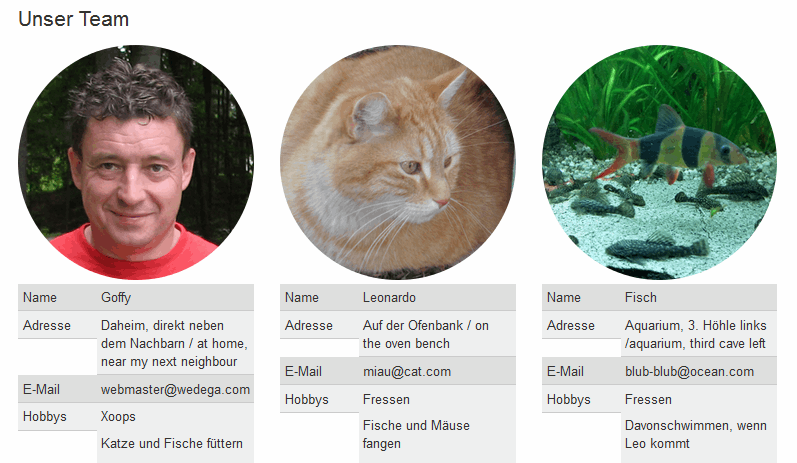
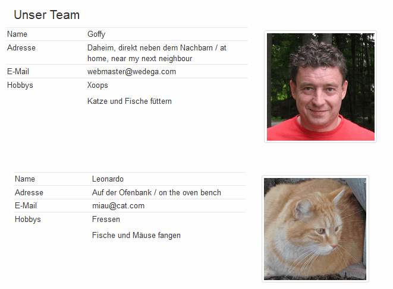

# 5. Die Userseite

Von den Usern sind grundsätzlich keine Aktionen erforderlich.

Je nach den Einstellungen können Sie ihre Teams in unterschiedlicher Weise anzeigen lassen.

#### 5.1 Präsentationsmöglichkeiten
Die Anzeige ihrer Teams ist
* über die Indexseite 
* oder über die Blöcke (siehe auch [Blöcke](6blocks.md))
möglich.

#### 5.2 Mögliche Präsentationstyles

**Beispiel 1:** Bild auf der linken Seite, Informationsbereich mit Rahmen, Mitgliedsbild mit abgerundeten Ecken

**Beispiel 2:** Bild oben, Informationsbereich gestreift, Mitgliedsbild im Kreisstil

**Beispiel 3:** Bild auf der rechten Seite, Informationsbereich liniert, Mitgliedsbild im Thumbs-Stil
