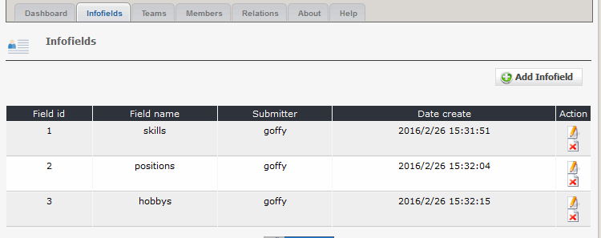
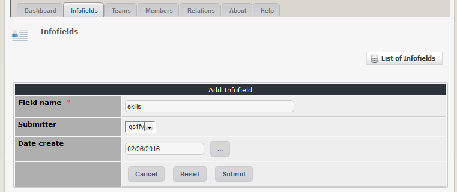

# 2.1 Infofields

For each person there are default fields like name, email, and so on (see also see [Members](2admin_members.md)).
For usage with teams see [Relations](2admin_relations.md)

#### 2.1.1 List infofields
On the dashboard tab 'infofields' you see a list of the existing infofields.

#### 2.1.2 Add/edit infofield

You have only to define the field name. You can show the field name also on user side.
