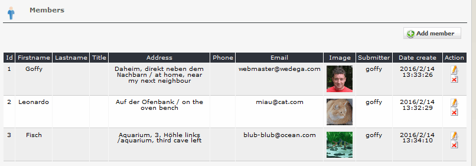
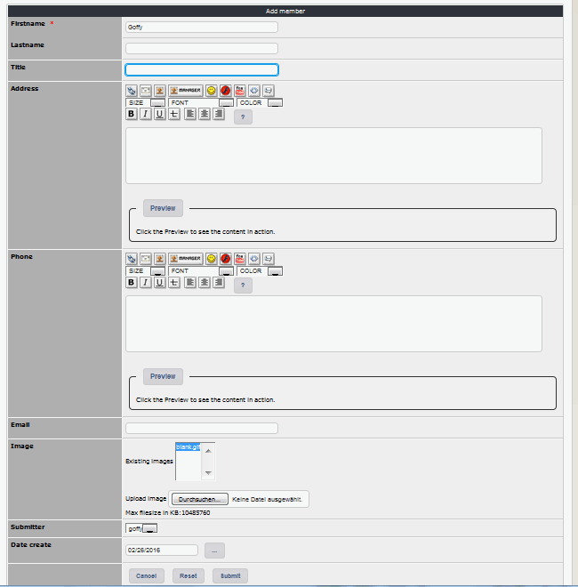

# 2.3 Members

You can define various members, which you can later combine with one or more teams.

#### 2.3.1 List members
On the dashboard tab 'members' you see a list of the existing members with the settings.

#### 2.3.2 Add/edit members

Besides the name you can define following default information for each person:
* Title
* Address
* Phone
* Email

This information will be used in each team.
Additionally you can upload one picture for each person.
