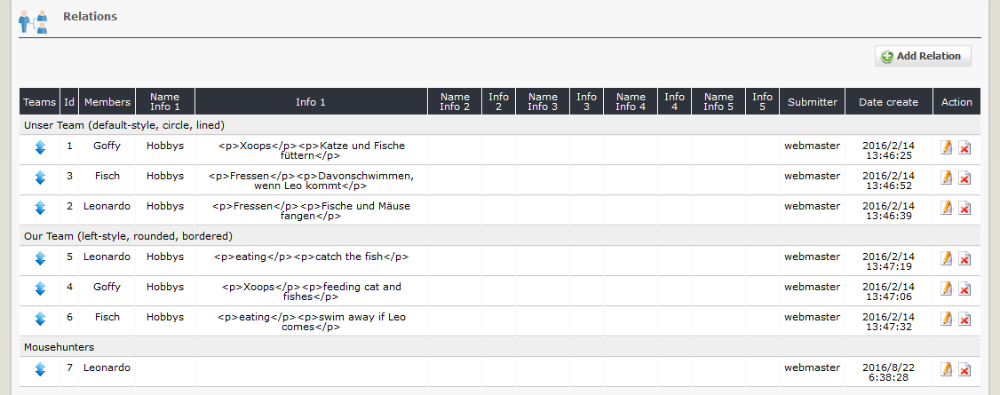

# 2.4 Relations

If you have created teams and put in members and additional infofields, you can now make relations between all of this.

#### 2.4.1 List relations
On the dashboard tab 'relations' you see a list of the existing relations with the settings.

#### 2.4.2 Add/edit relations

#### Teams and members
Define the team and person, which should be linked.

#### Infofields
Additional you can use 5 infofield, which will be shown on user side for this relation.

#### Weight
You can define the ranking of the members on user side.
