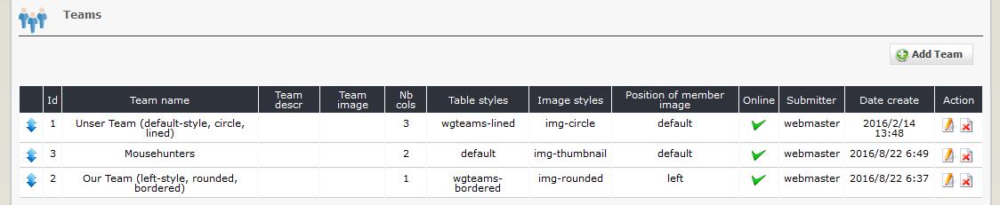

# 2.2 Teams

You can define various teams, which you can later combine with one or more members.

#### 2.2.1 List teams
On the dashboard tab 'teams' you see a list of the existing teams with the settings.

#### 2.2.2 Add new team

#### Team name
You can define a team name. This name will be shown on user side.

#### Team description
You can provide additional information concerning a team, which will be shown on user side.

#### Team image
You can use one image per team. This image will be shown on user side.

#### Nb cols
You can define, how many person will be shown in one row on user side.

#### Table styles
You can define a table style, which should be used on user side.
Following options are available:
* Default (use default styles)
* Bordered (Adds border on all sides of the table and cells)
* Striped (Adds zebra-striping to any table row)
* Lined (Add the rows a border top)

#### Image styles
You can define a image style, which should be used on user side.
Following options are available:
* Default (use default image styles)
* Circle (Shapes the image to a circle)
* Rounded (Adds rounded corners to an image)
* Thumbnail (Shapes the image to a thumbnail)

#### Position of member image
You can define the position of image of the members, how it should be used on user side.
Following options are available:
* Left (on the left side)
* Default (on the top)
* Right (on the right side)

#### Weight
You can define the ranking of the teams on user side, if you use a team list there.

#### Online
Define, whether a team should be shown on user side or not.
You can create a team and make all relations to the members. If you have finished all, you can set online to 'Yes'.
