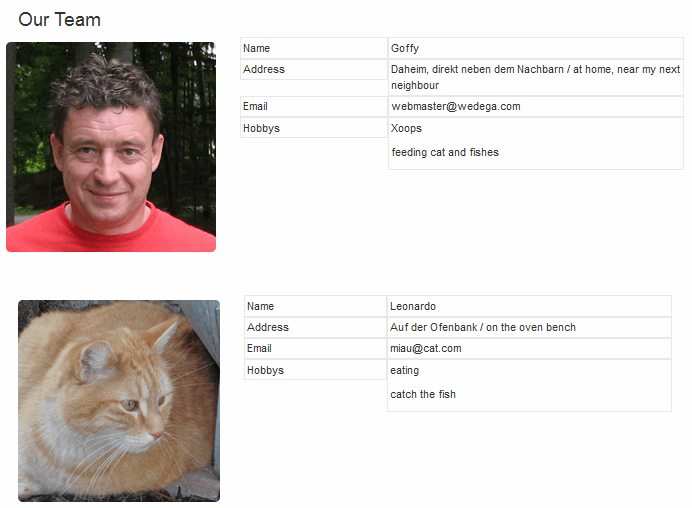
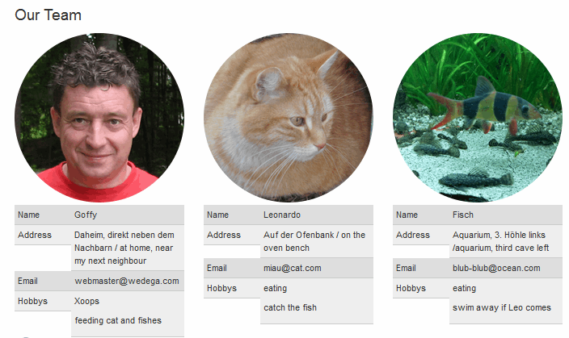
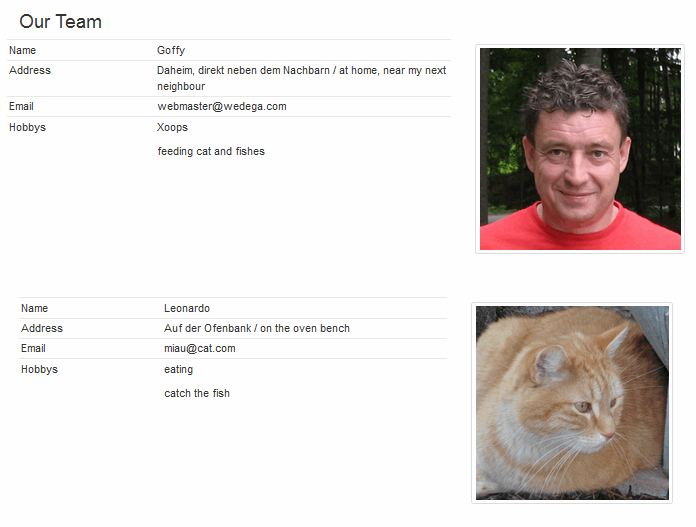

# 5. The User Side

For the users there is no action required on user side.

Depending on your settings/preferences you can present your teams in various ways.

#### 5.1 Possibilities for presentation
You can show your team(s) 
* via the index page 
* or with a block (see also [Blocks](6blocks.md))

#### 5.2 Possible presentation styles

**Example 1:** Picture on the left side, information area with borders, picture with round corners

**Example 2:** Picture on the top, information area striped, picture shaped as circle

**Example 3:** Picture on the right side, information area lined, picture in thumbs style
