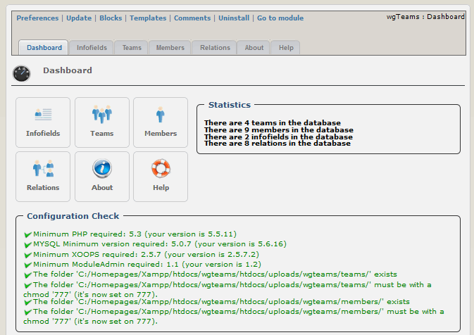

# Introduction

### User Manual

© 2014 The XOOPS Project \(www.xoops.org\)

### Module Purpose

This module is for presentation of your team\(s\).

You can defined various teams and people. After that you can link each person to one or more teams. The default information of a person will be used for all teams. You can define additional information fields, which will be used for a team/member combination, e.g. skills for this team, postion in the team, and so on.

All used templates on user side are fully responsive.

**This module works only in combination with a bootstrap theme or you have to include bootstrap files manually to your theme.**

_Figure 1: Main view of the wgTeams Module \(Admin side\)_

* **License:**

  
Unless specified, this content is licensed under a [Creative Commons Attribution-NonCommercial-ShareAlike 4.0 International License](http://creativecommons.org/licenses/by-nc-sa/4.0/).

All derivative works are to be attributed to XOOPS Project \(www.xoops.org\)

